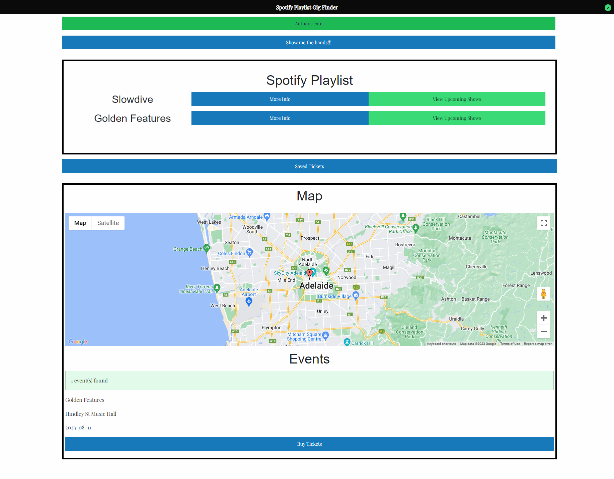

# Group1_Project

## Description

This is our Project 1 for the Monash Coding Bootcamp. We were tasked with creating
a unique web application utilising the skills we have aquired thus far in the course.

We decided to build a Gig Finder web application utilising Apis from Spotify,
Ticketek, Google Maps and LastFM.

Our User Story and Acceptance Criteria are as follows:

## User Story

```
When I go to a webpage, I can view tickets for upcoming shows for the artists in
my personal spotify playlists. I can also view a map of where the shows and read
information about the artists.
```

## Acceptance Criteria

```
GIVEN I access the website
WHEN I click the Spotify Authentication button
THEN I am redirected to Spotify's login page and aftwards redirected back to the page

WHEN I click on the 'Show me the Bands' button
THEN a list of artists from my Spotify Playlists that have upcoming shows is displayed

WHEN I click on the 'More Info' button
THEN I am presented with information about the artist

WHEN I click on the 'View Upcoming Shows' button
THEN I am presented with a list of upcoming shows for the artist

WHEN I click on the 'Buy Tickets' button
THEN I am redirected to a ticketing page where I can purchase tickets for the show
```

Link to deployed site: https://alexanderduncan1.github.io/Group1_Project/

## Screenshot of our application:



### Gif Link

[Download Link](https://mega.nz/file/qN12TDoQ#UOsvayVKS1e56XPkIeRZ5238YlyjMts-Sl7oEk0NOXo)

## Installation

### Usage Criteria:

To replicate the functionality of this project and achieve the same results, users are required to follow the provided usage criteria:

1. Obtain API Keys: Users must apply for their own API keys for the following APIs used in the project:

   - Spotify API: Used for retrieving music-related data.
   - Google Maps API: Used for displaying maps and location-related information.
   - Last FM API: Used for fetching music artist and track information.

   API keys are necessary for authentication and authorization to access the respective APIs.

2. API Key Application: Visit the websites of the API providers (Spotify, Google, and Last FM) and create an account if required. Follow the documentation or guidelines provided by each API provider to generate API keys specific to your account.

3. Replace Project API Keys: Once the API keys have been obtained, replace the existing API keys used in the project with the newly acquired ones. This ensures that the project can securely communicate with the APIs using the user's own credentials.

4. Configuration: Modify the project's configuration files or code to include the newly obtained API keys. This typically involves replacing the existing API key placeholders with the actual API keys obtained from the respective API providers.

5. Foundation CSS: This project uses the Foundation CSS framework for styling. If you wish to replicate the project's look and feel, include the necessary Foundation CSS files in your project. You can download the Foundation CSS files from the official Foundation website or include them via a CDN.

6. Testing: After configuring the project with the new API keys and including the Foundation CSS, thoroughly test the functionality to ensure that the project is able to interact with the APIs successfully and produce the desired results.

Following these usage criteria will enable users to replicate the project's functionality and achieve the same results by using their own API keys and including the Foundation CSS framework. It is essential to obtain individual API keys for legal and security reasons, as API keys are unique to each user and are used to control access to API resources.

## Requirments

The user must have a valid Spotify Account with some saved playlists to their account
and be willing to allow Geolocation on their browser

## Usage

Limited Usage - In this applications current implementation there are only limited accounts that will work.
for Spotify log in please use;
user name - group1apptest@gmail.com
password - TestingAccount

**Follow the layout of the page, starting at the top and click through the buttons in order**
**to see who is playing near you!!**
